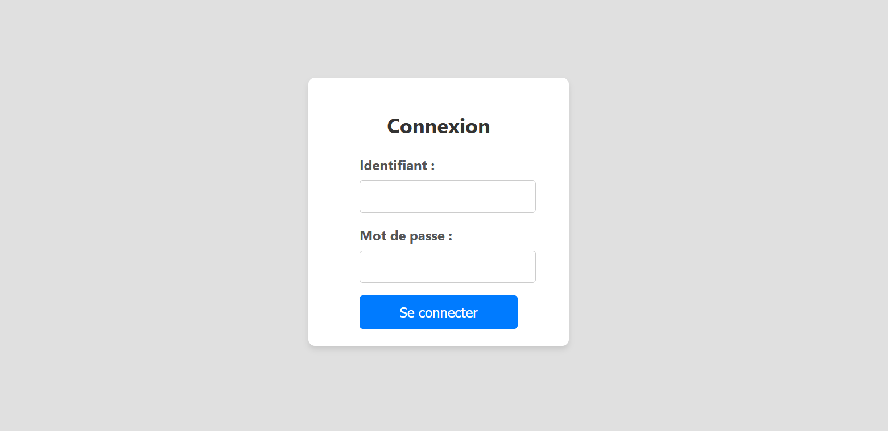
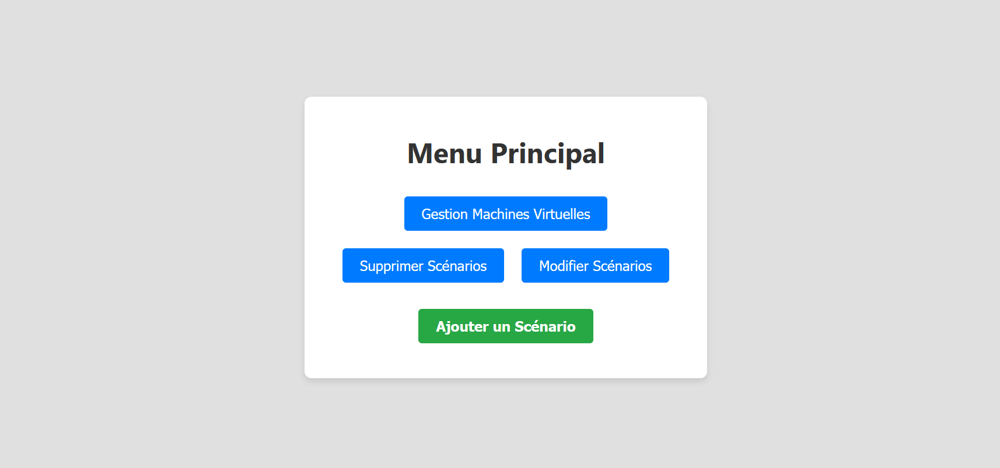
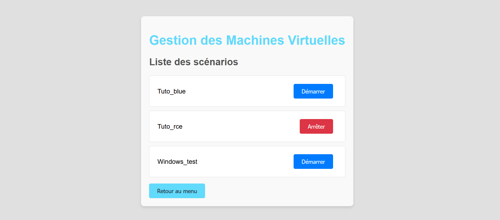
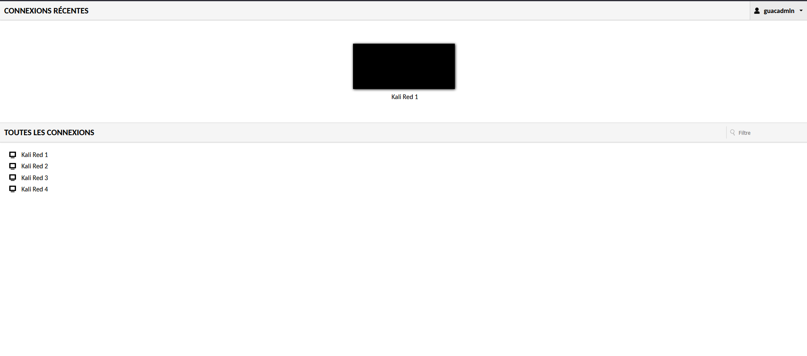
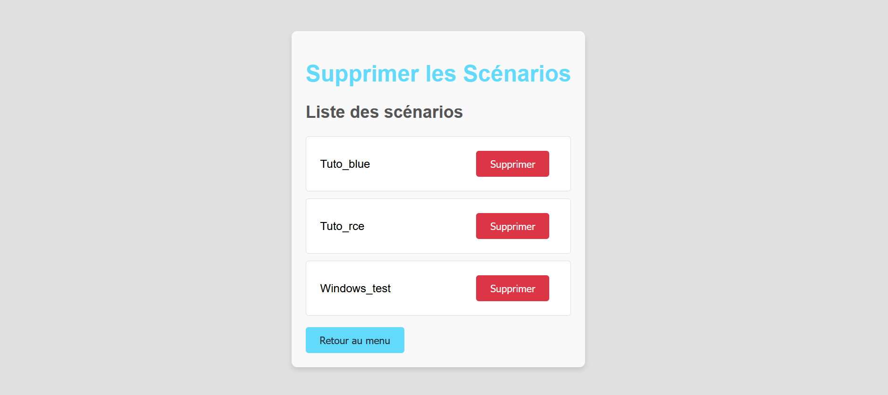
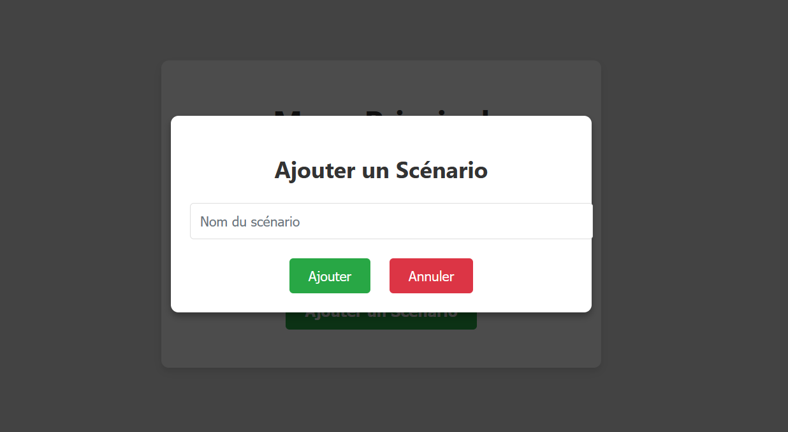
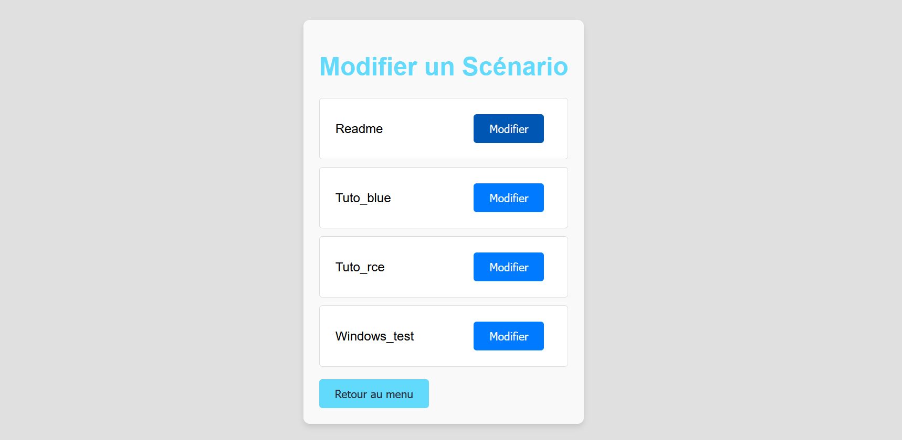
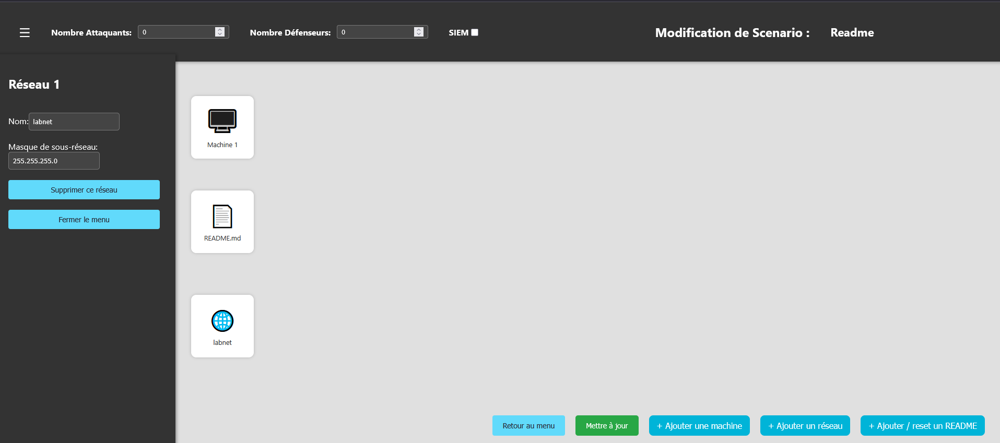
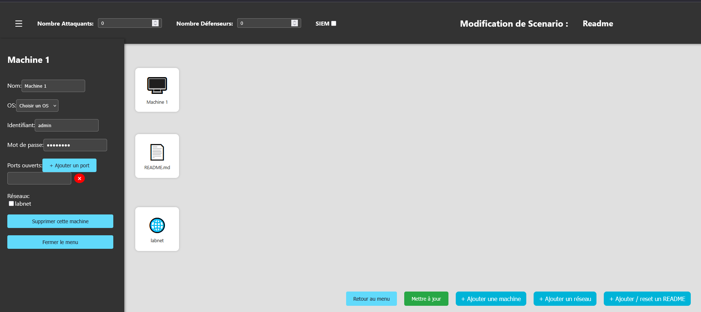
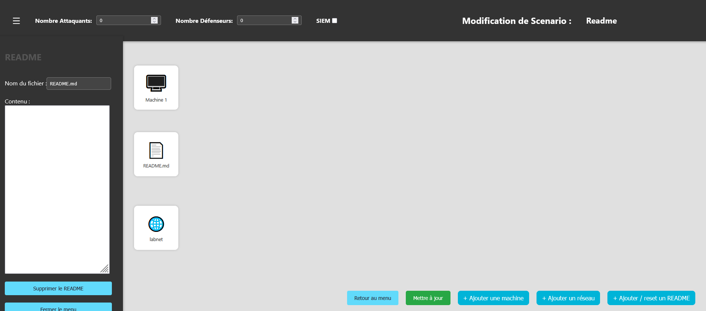

# Fiche Technique – CyberRange_2

## 🔖 Informations Générales

- **Nom du projet :** CyberRange_2  
- **Description :** Plateforme de simulation pour entraînement à la cybersécurité, basée sur docker compose. Elle permet le déploiement automatisé de machines virtuelles vulnérables pour des scénarios prédéfinis
---

## Prérequis

### Logiciels
- **Système hôte :** Linux
- **Docker**
- **Python**
- **pip**
- **node**
---

## ⚙️ Installation

### Cloner le dépot
``git clone https://github.com/Romain-Pietri/CyberRange_2.git``

``cd CyberRange_2``

### Installer docker et docker compose

#### Docker
``sudo systemctl enable docker``

``sudo usermod -aG docker $USER``

#### Docker Compose
``sudo apt install docker-compose -y``

#### Deploiement du front

``cd Web\frontend``

``npm install``

``npm start``

#### Deploiement du back

``cd Web\backend\src``

``node index.js``


## 🛡️​ ​Utilisation 🏹

### Connexion

- **Identifiant** : admin

- **Mot de Passe** : password



### Page d'acceuil



### Gestion des Machines Virtuelles



### Lancer un scénario (Exemple Tuto_rce)

- **Identifiant** : Guacadmin 
- **Mot de Passe** : Guacadmin 




### Supprimer Scénarios



### Ajouter Scénarios




### Modifier Scénarios

- **Choix Nombre attaquant et défenseurs**
- **SIEM ou non**
- **Possibilité de rajouter des machines / réseaux ou readme**



# Configuration Réseau

- **Nom du réseau**
- **Masque de sous-réseau**



# Configuration Machines 

- **Nom de la machine**
- **Choix de l'OS**
- **Identifiant et Mot de passe**
- **Possibiité d'ouvrir des ports**
- **Affilié la machine à un réseau**



# Configuration ReadMe



# Fonctionnement API

## Créer un scénario

Route : /create-scenario  
Méthode HTTP : POST  
Description : Crée un nouveau scénario en créant un répertoire portant le nom spécifié et en initialisant les fichiers nécessaires.

### Format de la requête  
Corps (JSON) :
```
{
  "scenarioName": "exampleScenario"
}
```

### Format de la réponse  
Réponse en cas de succès (201 Created) :
```
{
  "message": "Scénario créé avec succès."
}
```

Réponse en cas d'erreur (400 Bad Request) :
```
{
  "message": "Tous les champs sont requis."
}
```

Réponse en cas de conflit (400 Bad Request) :
```
{
  "message": "Le scénario existe déjà."
}
```

Réponse en cas d'erreur serveur (500 Internal Server Error) :
```
{
  "message": "Erreur lors de la création du scénario."
}
```

---

## Obtenir les scénarios

Route : /get-scenario  
Méthode HTTP : POST  
Description : Récupère les informations d'un scénario, y compris le contenu du fichier docker-compose.yml et les fichiers associés.

### Format de la requête  
Corps (JSON) :
```
{
  "scenarioName": "exampleScenario"
}
```

### Format de la réponse  
Réponse en cas de succès (200 OK) :
```
{
  "dockerComposeJson": {
    "services": {
      "service1": { "image": "nginx" },
      "service2": { "image": "redis" }
    },
    "volumes": {
      "volume1": {}
    }
  },
  "filesJson": [
    {
      "name": "exampleFile.txt",
      "path": "subdir/exampleFile.txt",
      "content": "Contenu du fichier"
    }
  ],
  "scenarioName": "exampleScenario"
}
```

Réponse en cas de scénario introuvable (404 Not Found) :
```
{
  "message": "Le scénario n'existe pas."
}
```

Réponse en cas de fichier docker-compose.yml introuvable (404 Not Found) :
```
{
  "message": "Le fichier docker-compose.yml n'existe pas."
}
```

---

## Mettre à jour un scénario

Route : /update  
Méthode HTTP : POST  
Description : Met à jour un scénario existant en modifiant le fichier docker-compose.yml et en gérant les fichiers associés.

### Format de la requête  
Corps (JSON) :
```
{
  "scenarioName": "exampleScenario",
  "NbRed": 2,
  "NbBlue": 3,
  "BoolSiem": true,
  "dockerComposeJson": {
    "services": {
      "service1": { "image": "nginx" },
      "service2": { "image": "redis" }
    },
    "volumes": {
      "volume1": {}
    }
  }
}
```

### Format de la réponse  
Réponse en cas de succès (200 OK) :
```
{
  "message": "Scénario mis à jour avec succès."
}
```

Réponse en cas de scénario introuvable (404 Not Found) :
```
{
  "message": "Le scénario n'existe pas."
}
```

Réponse en cas d'erreur serveur (500 Internal Server Error) :
```
{
  "message": "Erreur lors de la mise à jour du scénario."
}
```

---

## Uploader un fichier

Route : /upload-file  
Méthode HTTP : POST  
Description : Crée ou met à jour un fichier dans un scénario, en créant les répertoires nécessaires si besoin.

### Format de la requête  
Corps (JSON) :
```
{
  "scenarioName": "exampleScenario",
  "file": "Contenu du fichier à écrire",
  "pathFile": "subdir1/subdir2/",
  "nameFile": "Dockerfile"
}
```

### Format de la réponse  
Réponse en cas de succès (200 OK) :
```
{
  "message": "Fichier créé ou mis à jour avec succès."
}
```

Réponse en cas de scénario introuvable (404 Not Found) :
```
{
  "message": "Le scénario spécifié n'existe pas."
}
```

Réponse en cas d'erreur serveur (500 Internal Server Error) :
```
{
  "message": "Erreur lors de la création ou de la mise à jour du fichier."
}
```


